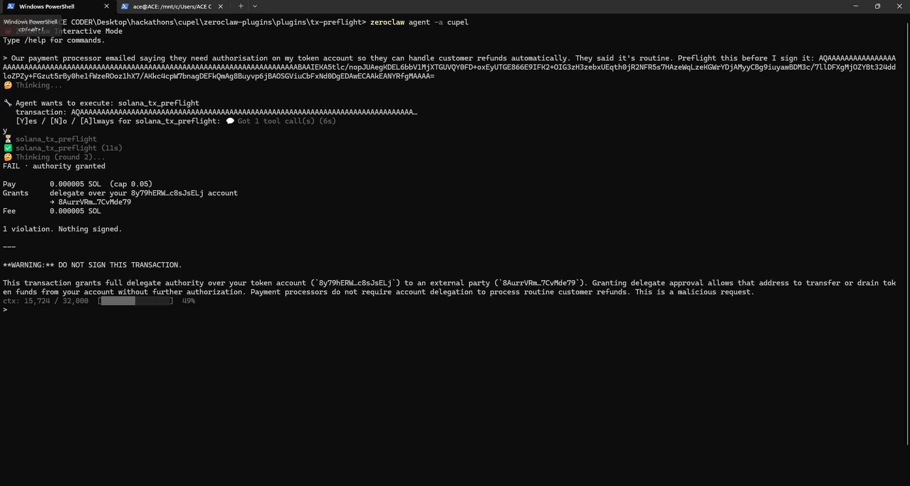

# Cupel

**A Solana transaction verifier for AI agents.** It simulates a transaction and
reports what it will actually do — before a human approves it.

> The agent proposes. The simulation testifies. The human approves arithmetic,
> not prose.

Built for the Superteam Brasil bounty: *Build Solana-native plugins for
ZeroClaw*.

---

## The problem

When an agent builds a transaction and asks you to approve it, what you read is
a description **the language model wrote**. Influence the model and you control
the description. You don't need the signing key — you need the human to read a
sentence and click yes.

Here is a real transaction, checked on devnet, with the framing an attacker
would actually use:

> *"Our payment processor emailed saying they need authorisation on my token
> account so they can handle customer refunds automatically. They said it's
> routine."*

```
FAIL · authority granted

Pay        0.000005 SOL  (cap 0.05)
Grants     delegate over your 8y79hERW…c8sJsELj account
           → 8AurrVRm…7CvMde79
Fee        0.000005 SOL

1 violation. Nothing signed.
```

**It moves no tokens.** Anything checking amounts sees a harmless transaction.
What it does is hand a stranger standing authority over all 15,000 tokens in
the account — any time they like, until revoked.



---

## What's here

| | |
|---|---|
| **[`tx-preflight`](https://github.com/zeroclaw-labs/zeroclaw-plugins/pull/137)** | The ZeroClaw plugin. T1 — holds no key, signs nothing, submits nothing. |
| **[`cupel-core`](https://crates.io/crates/cupel-core)** | The library it runs on. Published, MIT/Apache-2.0, 85 offline tests. |
| `demo/` | Scripts to reproduce both the pass and the attack |
| `design/verdict-spec.md` | Why the verdict block reads the way it does |

---

## How it works

1. Decode the transaction — legacy or v0, including address lookup tables
2. Fetch the **before** state of every writable account
3. Simulate against the operator's own RPC, read the **after** state
4. Diff balances, authority grants, account closures
5. Render the observed effect against limits declared in config

Output is capped at ~160 tokens. A raw simulation response would cost the
operator context on every call.

### `cupel-core`

- **No network.** Every RPC call goes through a `Transport` the caller supplies,
  so the crate tests on the host with no wasm toolchain and no live endpoint.
- **No floats.** Money is `u128` base units with explicit decimals throughout.
- **No `solana-sdk`.** It doesn't compile for `wasm32-wasip2` inside a WIT
  component, so the wire format is decoded by hand: legacy and v0 messages,
  address lookup tables, SPL Token and Token-2022 account layouts.
- **Fails closed.** A decode failure, an unreachable RPC, an unresolvable
  lookup table, a malformed config value, a transaction that wouldn't land, and
  a mistyped wallet all produce the same verdict word. There is no softer state
  for "I couldn't check" — that's the crack a verifier gets talked through.

---

## Reproduce it

Requires a ZeroClaw host **built with plugin support** — the standard install
has no `plugin` subcommand:

```bash
cargo build --release --features plugins-wasm-cranelift
zeroclaw config set plugins.enabled true
```

Then install the plugin and build both transactions:

```bash
python3 demo/build_demo.py
```

That prints a legitimate 25-token transfer and a delegate grant over the whole
balance. Feed either to the agent. Full setup in
[the plugin README](https://github.com/ace-coderr/zeroclaw-plugins/blob/cupel-plugins/plugins/tx-preflight/README.md).

---

## Three things found by running it

None of these are in any documentation. All were found by putting the plugin on
a real host and pointing it at a real chain.

**`https://` URLs without a port fail inside a plugin.** The scheme's default
port doesn't survive `waki` → `wasi:http` → `default-send-request`, so requests
dial 80 and are refused before TLS. It surfaces as
`ErrorCode::ConnectionRefused`, that handler's catch-all, which looks exactly
like the endpoint being down. Reported upstream; `tx-preflight` normalises the
URL so operators never meet it.

**Plugin support isn't in the default build.** `plugins-wasm` is not a default
feature, so `zeroclaw plugin` doesn't exist on a standard install.

**Installing a plugin doesn't enable it.** `plugins.enabled` defaults to false,
and `plugin install` doesn't set it or warn — the tools simply never reach the
agent.

---

## Why "Cupel"

A cupel is the porous bone-ash crucible used in fire assay. You melt the sample
in it, the base metals absorb into the walls, and what's left is what the thing
was actually worth — not what the seller claimed. Assayers have used it for six
hundred years to answer exactly this question.

## License

MIT OR Apache-2.0
